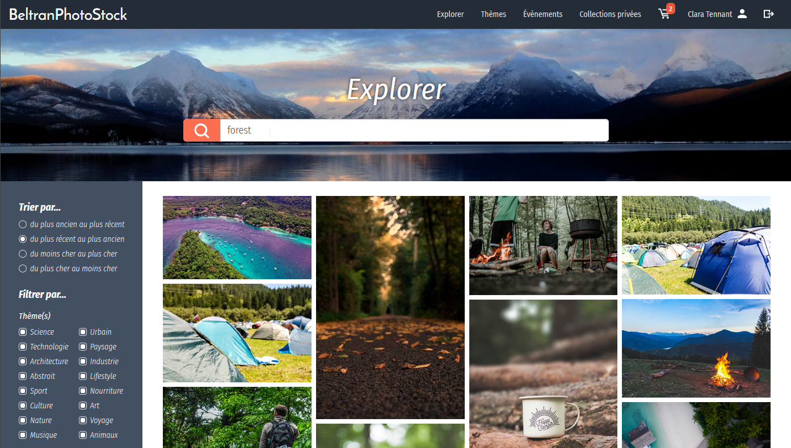
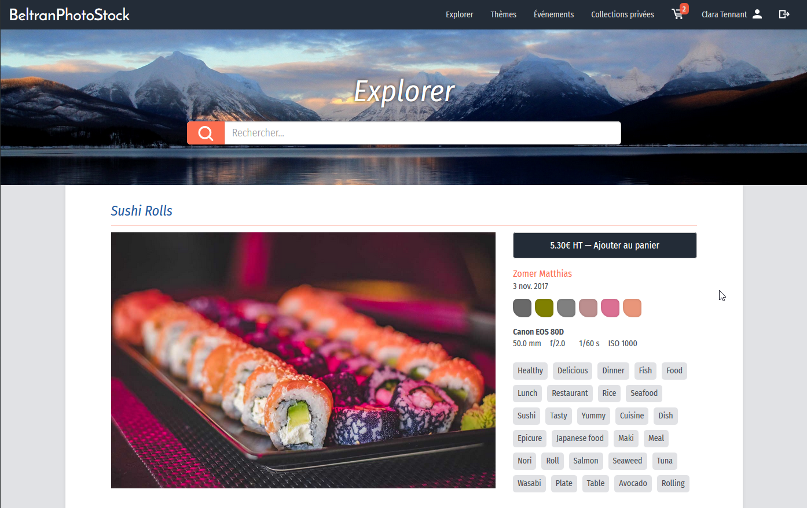
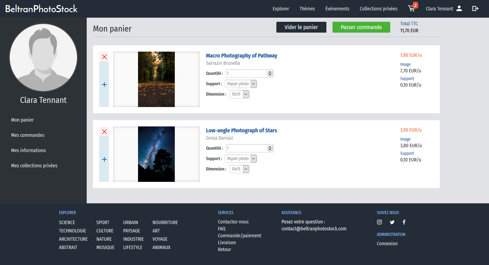
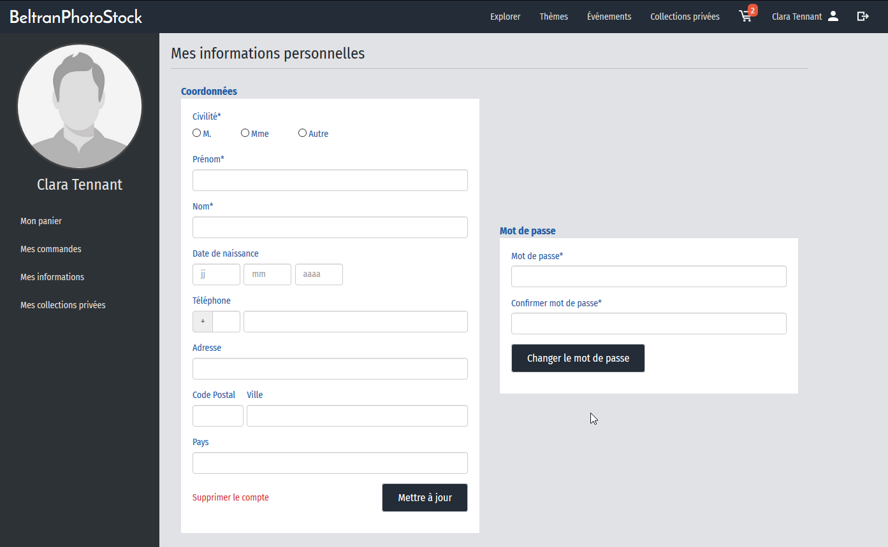

# **IUT-BeltranPhotoStock** :framed_picture::camera:


Shutterstock-like web platform developped from scratch with object oriented php following MVC design pattern and test driven development methods.

:mortar_board: Project made in the context of programming courses for a 2-year post A level degree (computer science).

## **Instructions** :wrench::gear:

1. Paste the `source` folder content on your web server,
2. Run `data/sample.sql` script in your MySQL database schema,
3. Open `source/model/DBConnector.php` and change the admin and password string (line 18).

```
static public function dbConnectAsAdmin() {
  return DBConnector::dbConnect('admin','password');
}
```

## **Notes** :notebook_with_decorative_cover:

- Images are free to use and come from Pexels
- PHP Tests have been written for PHPUnit

## **Preview** :rocket::framed_picture:








